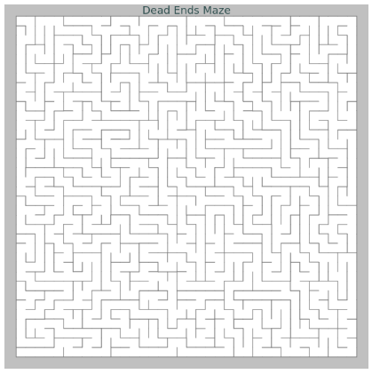
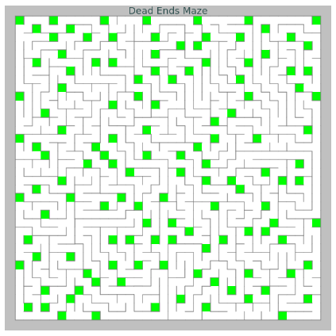
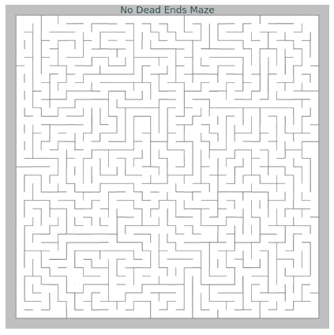

# Generating Dead Ends and No Dead Ends maze using Randomized Depth First Search ( DFS )

Here, I am not explaining DFS. Please learn about it on your own. I am just explaining how I implemented DFS.

## Randomized Depth First Search (DFS)

It is a randomized version of Depth First Search ( DFS ) where a random child node is selected and traversed.

## Dead Ends Maze

## Implementation example of Randomized DFS to generate Maze from Wikipedia

> - Choose the initial cell, mark it as visited and push it to the stack
> - While the stack is not empty
>   - Pop a cell from the stack and make it a current cell
>   - If the current cell has any neighbours which have not been visited
>     - Push the current cell to the stack
>     - Choose one of the unvisited neighbours ( at random )
>     - Remove the wall between the current cell and the chosen cell
>     - Mark the chosen cell as visited and push it to the stack

_(_ **_Note:_** _A random unvisited neighbour is selected because if the neighbour is selected in some kind of order the generated maze will alawys be the same. )_

By implementing above mentioned logic we can generate a maze and the generated maze will be a dead ends maze. This kind of mazes only has one solution. (i.e. Only one path from start to end). This is due to the reason that each and every cell is only visited once. So, the path that visits the end cell will only be the path that will ever visit the end cell.

## No Dead Ends Maze

The process of generating no dead ends maze is similar to that of generating dead ends maze.

## Implementation

> - Generate a dead ends maze
> - List all the dead end cells in array ( i.e. if the cell has more then 2 walls )
> - While the array is not empty
>   - Remove a random wall from the dead end cell
>   - List all the dead end cells in array ( this process is repeated since removing a wall from dead end cell can cause its neighbour's dead end to be removed )

